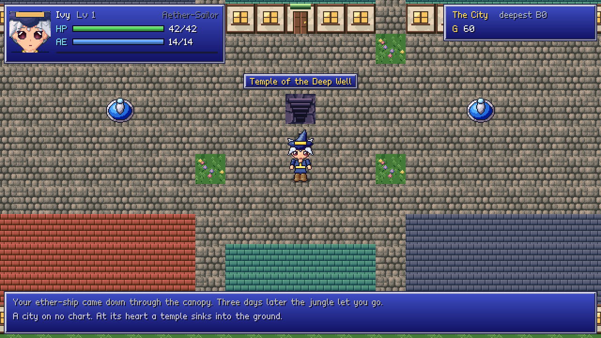
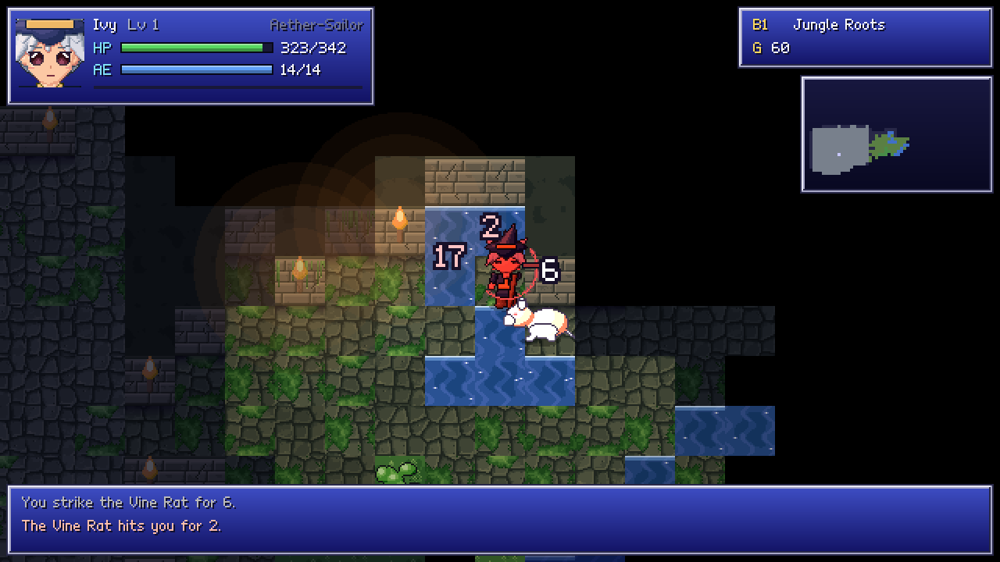
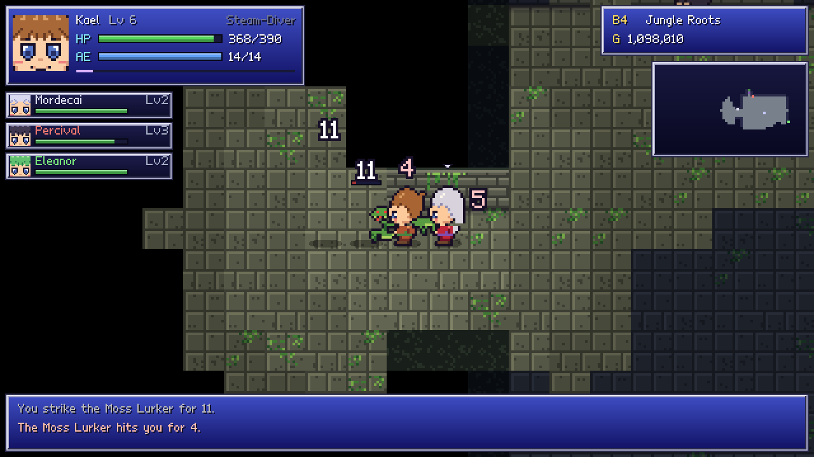

# Aether Descent — Godot edition

The terminal roguelike in `../src`, rebuilt in Godot 4 as a 16-bit RPG:
32×48 anime heroes with walk, attack and cast animations, 48×48 monsters,
64×64 portraits, shaded 32px tiles across five biomes, FF-style blue windows,
banded lighting, and synthesised chiptune sound effects.

The rules are the C game's. The class, spell and monster tables are read
straight out of the C source by `tools/gen_data.py`; the damage model,
escalation, monster AI, floor generation, spells, ranged weapons, abilities,
features and the town are ported function by function, with the C names kept
in comments so you can find both halves of a rule.






More in [`screenshots/`](screenshots): the title, character creation, the
Armory, the Tavern, and the Classic art set.

## Running it

1. Install [Godot 4.3](https://godotengine.org/download) or newer (the
   standard build — no C#).
2. Open `project.godot` in this folder, and press Play (F5).

On first open, Godot imports the textures in `assets/`; that takes a few
seconds. The game runs at 640×360 and scales by whole numbers to your window,
so pixels stay sharp: 1280×720 by default, and 1920×1080 full-screen.

Saves, the Inn snapshot and high scores live in Godot's user folder
(`user://`): `~/.local/share/godot/app_userdata/Aether Descent` on Linux,
`%APPDATA%\Godot\app_userdata\Aether Descent` on Windows.

## Controls

| | Keyboard | Gamepad |
|---|---|---|
| Move / attack | arrows, `hjkl` `yubn`, number pad | D-pad |
| Wait | `.` `Space` numpad `5` | A |
| Auto-explore | `x` (any key stops it) | |
| Cast a spell / recast last | `m` / `s` | LB |
| Fire ranged weapon | `f` | Y |
| Class ability | `a` | X |
| Pack | `i` | RB |
| Character sheet | `c` | |
| Whole-floor map | `Tab` or `M` | Back |
| Recall charm | `r` | |
| Work what is beside you | `g` (any key stops) | |
| Records (this run, best by class, the fallen) | `Shift+R` | |
| Take over the next of your party | `p` | stick click |
| Menu (save & quit) | `Esc` | Start / B |
| Menus | arrows, `Z`/`Enter`, `X`/`Esc`, Left/Right for tabs | D-pad, A, B |

Walk into a door in the city to go inside; the temple stairs in the middle of
the plaza take you down to any floor you have already reached.

## What is in

- **Character creation** — four difficulties, three world sizes, all 100
  classes across the 7 archetypes, with their attributes, derived stats,
  school, ability and archetype starting kit.
- **The dungeon** — 100 floors in five biomes; five room shapes, nearest-first
  corridors, lakes, lava and miasma; 13 kinds of wild district (jungle, sea,
  swamp, ruins, mycelium, hive, mire, crystal, quiet quarter, blood marsh,
  chromatic abyss, carnivorous garden, quicksand), with their rules: the
  mycelium hears you walk, the hive and the quiet quarter wake together, the
  mire cuts your sight, crystals ricochet spells and shot, blood pools heal
  monsters, the prisms change your stance, snares hold you; and 14 more: the
  storm-cage and the vent field (telegraphed strikes that kill whatever is
  beside the rod), the arena (ten waves behind a shut gate), the aqueduct and
  the assembly line (channels and belts that carry you; three keys at the
  console build you a golem), the watch (start nothing and take the
  strongbox), the barrow (your own lost runs, standing up again), the eye
  (one safe quarter, and it moves), the mirror (a copy of you), the stone
  wood (ambushes), the workings (pits that drop you a floor, ore in the
  galleries), the boneyard (golem cores), the proving ground (blades only,
  the arts only, or no weapons -- a writ if you play by it) and the chapel
  (they notice you only up close); the camp; vaults with keys and levers;
  portals; floor events; gold-rush and overrun floors.
- **Work and materials** — `g` works what is beside you for several turns,
  and anything that hurts you ruins it: ore veins, rods, vents, wrecks in old
  quarters and golem cores in boneyards. Scrap, platinum and diamond come up
  by depth; the smith wants platinum past +20 and diamond past +50, and the
  Junkyard buys whatever you would rather sell.
- **Monsters** — the curated rosters and the generated variants, escalation,
  swarm scaling, elites every tenth floor, the four biome bosses and the
  Warden on floor 100; line-of-sight aggro, wandering, chasing; poison, stun
  and slow; respawning and the doubling that punishes loitering.
- **Combat** — `attack² / (attack + defence)`, crits, evasion, ward, monster
  crits, jinx, gear-set procs; all 180 spells and all 23 effects; the 18
  ranged weapons with their six behaviours; the 10 class abilities.
- **The city** — General Store, Armory (weapons, armour, ranged, accessories,
  smithing), Apothecary, Arcanist's Guild, Bank, Inn, Gladiator School,
  Junkyard, Black Market, Oracle, the temple; merchants in the dungeon.
- **The Tavern and hired heroes** — the Brass Lantern, west of the plaza:
  twenty candidates drawn from the same hundred classes, each priced ten times
  the last (1,000 up to 10,000,000), scaled to how strong you are when you
  hire them. They are not pets: they walk the floor on their own, fight with
  their own spells, guns and bows, use their role's signature move (Bulwark,
  Flurry, Called Shot, Detonation, Charge Bomb, Second Wind, Rally), pick up
  loot and hand you the gold, find their own gear, level off their own kills,
  and back off or press on according to temperament (Bold, Steady,
  Cautious). Monsters fight whoever is next to them. A fallen hire can be
  taken back for a quarter; one you let go hands back half the fee. Press `p`
  to take over any of them -- and if you fall, one of them carries on, or
  spends a recall charm to drag you home.
- **The east side of the plaza** — the Ashfall Kitchen (meat comes only off
  your own blade, graded stringy to mythic; cook a seven-cover service night
  once per trip down, and the house's reputation compounds), the Lizard
  Track (six runners, a bookmaker whose prices shorten after three races), the
  Barter Bazaar (the Apothecary's bottles at a price that moves every trip)
  and the Altar (trade one attribute point for another, at half the
  training price).
- **The bounty board** — east of the temple, one notice at a time, six
  kinds: slay a named monster, recover an item, clear a floor, reach a floor
  against the clock, reach one without cracking a recall charm, or get a
  client there alive. The client is an ordinary body in your party who
  fights for themselves -- you can even take them over with `p`.
- **Features** — shrines, fountains, machines, relics and the five gear sets,
  altars, tolls, waygates.
- **Hearing** — monsters within your Hearing radius show through walls as
  a ring: a position, not an identity. The chapel takes it away.
- **Auto-explore**, recall charms, death and waking at the Inn (permanent on
  Hardcore), save and resume, high scores.

## What the run does about how it is going

Ported from `dda.c` and `bands.c`, and invisible on purpose: a pressure
reading of how your floors have been going, and five small gifts the
places give a run that is drowning -- the Roots regenerate you, the Works
give aether and shot back faster, the Ruins' wards turn blows aside, the
Wastes' salt sometimes keeps a draught unspent, the Abyss's dark hides you.
They only ever add. Each band also has a rule it always keeps: the growth
hides everyone, the Ruins' monsters ward some of your blows, the Wastes'
ground bites harder, the Abyss takes your sight (Aether-Sense keeps more).

The **guardian angel** (Esc menu) is an assist, off unless you switch it on:
the dice lean your way when you are in trouble, one killing blow a floor is
turned aside above floor 50, and a run that is coasting gets leaned on.

Everything in the C game is ported. On the Deeps and the Well, a floor takes
a moment to build: a card says where you are going while it does.

## Art: 16-bit or Classic

Two art sets, switched from the title screen or the Esc menu (and
remembered):

- **16-bit** — shaded, modelled anime sprites: 32×48 heroes, 48×48
  monsters, 64×64 portraits, textured 32px tiles.
- **Classic** — the flat look of the first mockups: hand-drawn 16×24 heroes
  and 16×16 monsters, 32px portraits, 16px tiles, drawn at 2×. It has its
  own front, back and side views, a four-frame walk, a three-frame attack
  with the class's weapon and a slash, and a cast pose.

Both sets share one sheet layout (Classic is exactly half-size), so the game
code does not know which one it is drawing.

## How it is built

```
scripts/core/   the rules: no nodes, no frames -- testable headless
  game.gd         the run (autoload Game): hero, purse, pack, floors, saves
  hero.gd         a body: attributes, derived stats, gear       (classes.c)
  monster.gd      rosters, variants, bosses, escalation         (monsters.c)
  mapgen.gd       floor generation                              (mapgen.c)
  rules.gd        turns, combat, AI, spells, ranged, features   (combat.c ...)
  spellbook.gd    the 180-spell pool                            (spells.c)
  party.gd        the Tavern and hired heroes                   (companions.c)
  quests.gd       the bounty board                              (quests.c)
  kitchen.gd      the Kitchen, the lizard track, the Bazaar      (kitchen.c)
  districts.gd    the later districts' rules, and work (`g`)     (combat.c, main.c)
  dda.gd          pressure, the band gifts, the guardian angel   (dda.c, bands.c)
  autoexplore.gd  `x`
  town.gd         the plaza
  sfx.gd          synthesised sound effects (autoload Sfx)
scripts/data/   tables: generated from ../src, plus the stock lists
scripts/ui/     drawing: the map view and its animations, menus, screens
tools/          the art pipeline (Python + Pillow + NumPy)
tests/          headless smoke run and screenshot drivers
mockups/        the art-direction mockups
```

The rules resolve a turn instantly and queue events (`Game.fx`); the map view
plays them back as animation — a step slides 32px through the walk cycle, a
swing plays wind-up, strike and follow-through, hits flash and throw numbers,
spells and shots fly.

### The art pipeline

Nothing in `assets/` is hand-drawn. Sprites are *modelled*: each body part is
a shaded primitive (sphere, tapered limb, cushioned polygon), lit from the
top left and resolved to cel tones with ink outlines — so every pose of every
character comes from the same model, and a new colour scheme or pose is a code
change. Faces get hand-painted anime eyes on top.

```bash
pip install pillow numpy
python3 tools/gen_data.py      # class/spell/monster tables from ../src
python3 tools/gen_art.py       # every texture, ~90 s
python3 tools/classic/gen_classic.py   # the Classic set (after gen_art.py)
python3 tools/mockups.py       # the mockup screens and the walk/attack GIF
```

### Tests

```bash
godot --headless --path . tests/smoke.tscn
```

plays several characters down through the floors on auto-explore, checks
that nobody stands in a wall or on top of anybody else, that every generated
floor's stairs connect on two world sizes, and that a save round-trips.
`tests/shots.tscn` and `tests/shots2.tscn` drive the real game with key
presses and write screenshots (run them with a display, or under
`xvfb-run`).
